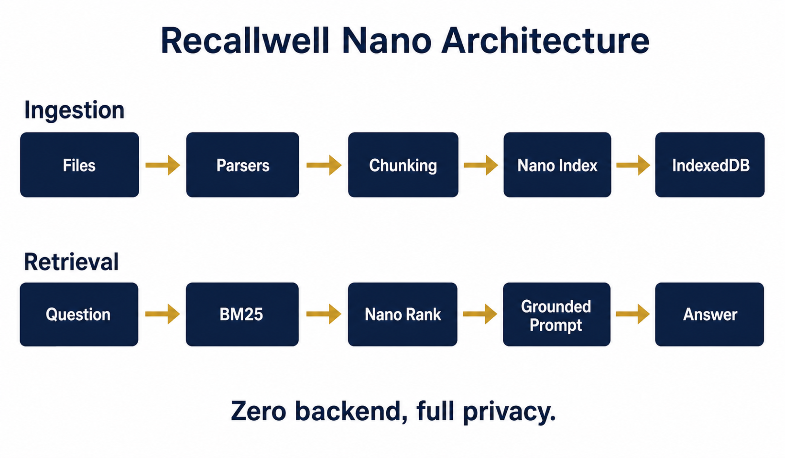

<div align="center">


# Recallwell Nano

**On-device, vectorless knowledge-base Q&A in the browser.**

*Powered by Chrome Gemini Nano — zero backend, zero network calls, full privacy.*

---

</div>

## Overview

Recallwell Nano is a fully client-side knowledge base that runs entirely in your browser. It uses Chrome's built-in **Gemini Nano** (Prompt API) to answer questions about your documents without any backend server or network calls at runtime.

<div align="center">



</div>

### Key Principles

| | Principle | Description |
|---|---|---|
| 🔒 | **Offline-first** | Works without internet after initial load |
| 🧠 | **Vectorless** | Uses LLM-driven relevance over plain text, not vector embeddings |
| 🏠 | **Zero backend** | All processing happens in the browser |
| 🔐 | **Private** | Your data never leaves your device |

## Architecture

The system operates in two pipelines:

### Ingestion Pipeline

```
Files → Parsers → Chunking → Index Cards (Nano) → IndexedDB
```

1. **Files** — Drag & drop `.txt`, `.md`, `.html`, `.pdf`
2. **Parsers** — Extract text content (pdf.js for PDFs)
3. **Chunking** — Heading-aware splitter with token estimation
4. **Index Cards** — Gemini Nano generates summaries + keywords per chunk
5. **IndexedDB** — Dexie stores chunks + index cards locally

### Retrieval Pipeline

```
Question → BM25 Shortlist → Nano Rank → Grounded Prompt → Answer + Citations
```

1. **Question** — User asks a question in the chat interface
2. **BM25 Shortlist** — Coarse keyword filter narrows candidates
3. **Nano Rank** — LLM relevance ranking of shortlisted chunks
4. **Grounded Prompt** — Context + question sent to Nano with citation instructions
5. **Answer + Citations** — Grounded response with clickable source references

## Tech Stack

| Category | Technology |
|---|---|
| Framework | Vite + TypeScript |
| PWA | Progressive Web App |
| Storage | Dexie (IndexedDB wrapper) |
| AI | Chrome Built-in Gemini Nano (Prompt API) |
| PDF | pdf.js |
| Testing | Vitest + Playwright |

## Getting Started

### Prerequisites

- **Chrome 131+** with built-in AI enabled
- Visit `chrome://flags/#prompt-api-for-gemini-nano` and set to **Enabled**
- Restart Chrome

### Installation

```bash
# Install dependencies
npm install

# Start development server
npm run dev

# Run tests
npm test

# Build for production
npm run build

# Run Playwright tests
npx playwright test
```

## Usage

### Ingest Documents

1. Open the app in Chrome
2. Drag and drop files onto the dropzone
3. Watch the ingestion pipeline process your files

### Ask Questions

1. Type a question in the chat input
2. Press Enter or click Send
3. View the grounded answer with clickable citations

### Export / Import Knowledge Base

1. Click **Export Knowledge Base** to download a `.rwkb.json.gz` snapshot
2. Import snapshots on other devices for read-only Q&A

## Browser Requirements

| Requirement | Details |
|---|---|
| Browser | Chrome 131+ (Desktop) |
| OS | Windows 10/11, macOS 13+, Linux, ChromeOS |
| Flag | `chrome://flags/#prompt-api-for-gemini-nano` → Enabled |
| Storage | ~200MB for Gemini Nano model download |

## Privacy

- All processing happens in your browser
- No data leaves your device
- No backend server
- No network calls at runtime (after initial load)

## Contributing

See [CONTRIBUTING.md](CONTRIBUTING.md) for guidelines.

## License

MIT
